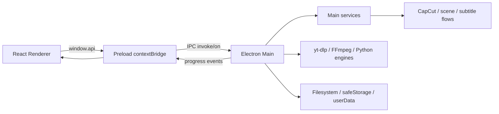

# Bản đồ module và entrypoint T-blao

> Đọc tài liệu này sau [CODEBASE.md](../CODEBASE.md) khi task cần biết file nào sở hữu một luồng hoặc một loại state. Snapshot được đối chiếu ngày **2026-08-17**, version **0.1.25**.

## Mô hình thực thi

Boundary ổn định của ứng dụng là `Renderer → Preload → Main`. `shared` cung cấp type/contract nhưng không sở hữu quyền hệ thống. Engine Python/binary không được import trực tiếp vào Renderer; Main spawn và chuyển đổi protocol của chúng.

## Root map

| Path | Nội dung thực tế | Không nên nhầm với |
| --- | --- | --- |
| `src/` | Ứng dụng Electron/React/TypeScript | output `out/` |
| `engines/` | Source Python, PyInstaller spec, test và README engine | binary đã build trong `dist/` |
| `scripts/` | Feature generator, architecture check, font/package checks | business service |
| `.github/workflows/` | Build runtime assets và release app | local build script |
| `resources/fonts/` | `catalog.json`, README và font được phép copy local | thư mục nguồn `font/` bị ignore |
| `build/` | build resources như icon | output app `dist/` |
| `docs/` | Tài liệu project và knowledge base | source runtime |
| `test-artifacts/` | draft/video/audio/SRT sinh từ smoke test | test code |

Root configuration quan trọng:

| File | Vai trò |
| --- | --- |
| `package.json` | version, dependencies và lệnh dev/build/package/verify |
| `package-lock.json` | lockfile npm |
| `electron.vite.config.ts` | ba bundle Main/Preload/Renderer vào `out/` |
| `electron-builder.yml` | appId, resources, Windows NSIS, macOS DMG/ZIP, publish target |
| `electron-builder.local.yml` | config kế thừa cho Windows portable local, app ID/tên/output riêng |
| `tsconfig.node.json` | typecheck Main/Preload/scripts Node |
| `tsconfig.web.json` | typecheck Renderer/shared web-facing code |
| `engines-manifest.json` | version map local đang ship cho engine assets |
| `.gitignore` | loại build output, secret, runtime data, binary/font và cache |

## TypeScript application

### Main entrypoint và orchestration

| File | Trách nhiệm | State/process đáng chú ý |
| --- | --- | --- |
| `src/main/index.ts` | đăng ký privileged `tblao` protocol, single-instance lock, BrowserWindow, lifecycle, 68 core IPC handler và đăng ký feature Main | giữ `mainWindow`; gửi log/progress về Renderer; `registerIpc()` chứa core boundary |
| `src/main/logger.ts` | log memory/file/UI, làm sạch nhãn lỗi và mở log | `logEmitter`, log file trong userData |
| `src/main/runtimeSetup.ts` | gate khởi động cho yt-dlp + FFmpeg core; optional feature engine cài on-demand | `TBLAO_DEV_ALLOW_MISSING_RUNTIME=1` bypass gate cho dev |
| `src/main/deps.ts` | resolve/cài managed yt-dlp, FFmpeg/FFprobe, asset download, zip staging/rollback | `userData/bin`, `ASSET_BASE`, managed binary ưu tiên |
| `src/main/updater.ts` | electron-updater và trạng thái check/download/install | bản local portable bỏ qua updater; release vẫn dùng GitHub |
| `src/main/engines-update.ts` | đọc manifest remote, so version local, đánh dấu engine đã cài | `userData/bin/engines-local.json` |

`app.whenReady()` trong `src/main/index.ts` đăng ký `tblao` handler, gọi `registerIpc()`, tạo window, khởi động auto-update yt-dlp và updater. `registerMainFeatures(() => mainWindow)` được gọi sau khi core IPC đã sẵn sàng.

### Main domain adapters

| Miền | File | Luồng chính |
| --- | --- | --- |
| Download | `src/main/ytdlp.ts` | fetch metadata/playlist bằng JSON, build args, download progress, archive, subtitle/metadata/thumbnail, H.264 fallback và error classification |
| Cookie | `src/main/cookies.ts` | Electron session, Netscape cookie file theo domain, site cookie cho Facebook/Bilibili, migration/lock/cleanup |
| Cookie Douyin | `src/main/douyinCookies.ts` | session/partition và JSON cookie riêng cho `dy-engine` |
| Proxy/site policy | `src/main/proxy.ts`, `src/main/sitePolicy.ts` | test proxy, cache capability/policy của site và invalidation khi yt-dlp update |
| Douyin | `src/main/douyin.ts` | cài binary, viết config JSON/YAML-compatible, spawn engine, parse progress/summary, lưu channel library |
| Whisper | `src/main/whisper.ts` | cài onedir engine, cache model, optional CUDA, gửi args và đọc JSON-lines progress/result |
| GPU | `src/main/gpu.ts` | probe NVIDIA/driver/CUDA trước khi cho dùng device `cuda` |
| OCR | `src/main/ocr.ts` | cài engine, spawn theo args, đọc JSON-lines, chuyển SRT sang TXT/VTT/JSON, cancel |
| Burn subtitle | `src/main/burn.ts` | đọc SRT, preview, ASS/style/wrap, crop/blur/audio filter graph, FFmpeg encode và cancel |
| Font | `src/main/fonts.ts`, `src/main/fontMeasure.ts` | catalog font, URL `tblao://`, đo chữ OpenType và fallback |
| Video enhance | `src/main/video2x.ts` | cài/resolve Video2X, list device, build args, parse progress line, cancel |
| Translation | `src/main/gemini.ts`, `src/main/openai.ts`, `src/main/translate-shared.ts` | safeStorage key, model fallback, timeout/schema, chia SRT và progress |
| Dedicated SRT translation | `src/main/features/srt-translator.ts`, `src/main/services/srt-translator-job.ts` và các service SRT | verified video + SRT, restoration/audit/review tiếng Việt, bản địa hóa locale tuần tự, dialog xuất |
| App update | `src/main/updater.ts` | check/download/install qua GitHub release provider |

### Main feature modules và services

Các feature mở rộng được đăng ký qua `src/main/features/registry.ts` và gọi service riêng khi nghiệp vụ lớn:

| Feature | Main module | Service/implementation | Keep-alive |
| --- | --- | --- | --- |
| `media-inspector` | `src/main/features/media-inspector.ts` | scaffold echo/progress | `false` |
| `scene-splitter` | `src/main/features/scene-splitter.ts` | `src/main/services/sceneSplitter.ts` | `true` |
| `capcut-factory` | `src/main/features/capcut-factory.ts` | `capCutFactory.ts`, `nativeCapCutGenerator.ts`, `capcutPortability.ts`, `voiceSync.ts` | `true` |
| `srt-translator` | `src/main/features/srt-translator.ts` | `srt-translator-production.ts`, `srt-translator-job.ts` và service graph SRT | `true` |

### Workflow và ownership của `srt-translator`

Feature này đi qua 5 bước: **Nguồn → Phục hồi → Duyệt → Bản địa hóa → Xuất**.

- **Nguồn:** `src/main/services/srt-source-validation.ts` parse SRT nghiêm ngặt và fingerprint. Workflow mặc định không cần video/audio; validator media chỉ còn cho caller cũ.
- **Phục hồi:** `src/main/services/srt-source-restoration.ts` tạo cue windows kèm toàn bộ `documentContext`, suy luận theo ngữ pháp/ngữ cảnh/đồng âm/thuật ngữ và validate pass restoration. `src/main/services/srt-source-audit.ts` chạy audit độc lập pass hai chỉ trên SRT.
- **Duyệt:** audit trả canonical source và candidate/evidence `meaningVi`; Renderer hiển thị cue mơ hồ bằng tiếng Việt, Main chỉ chốt khi đủ lựa chọn.
- **Bản địa hóa:** `srt-locale-profiles.ts` chọn style/currency/unit theo locale; `exchange-rates.ts` xử lý rate snapshot và attribution; `measurement-conversion.ts` xử lý unit; `srt-localization.ts` khóa fact token, validate SRT và giữ partial target result.
- **Xuất:** Main feature mở Save/folder dialog và tạo tên locale; mọi kết quả SRT-only thêm `_unverified.srt`.

| Module | Ownership |
| --- | --- |
| `src/shared/features/srt-translator.ts` | Contract serializable, 9 channel names, SRT-only review/locale/progress/export DTO |
| `src/main/features/srt-translator.ts` | IPC/dialog/file boundary; không giữ prompt nghiệp vụ |
| `src/main/services/srt-translator-production.ts` | Composition root nối API key, text generation transport, rate provider, logger/trace và nhánh media legacy |
| `src/main/services/srt-translator-logging.ts` | Contract trace phase, request/response Gemini, retry, heartbeat và thời lượng; serializer che key/URI nhưng payload có thể chứa SRT/prompt |
| `src/main/services/srt-translator-job.ts` | Single active job, fingerprint gate, upload một lần/reuse/delete, cancel/release, progress |
| `src/main/services/subtitle-pipeline.ts` | Orchestrate video → OCR → ASR → fusion → Gemini restoration/audit → translation; heartbeat 30 giây, cancel và cleanup |
| `src/main/services/subtitle-pipeline-fusion.ts` | Pure parser/alignment của ASR/OCR/SRT; giữ provenance, conflict, similarity và corroboration hai nguồn |
| `src/main/services/srt-source-validation.ts` | SRT parser, video validation, FFprobe và fingerprint |
| `src/main/services/gemini-files.ts` | Resumable upload, processing poll, structured generate, retry/timeout/abort và delete |
| `src/main/services/srt-source-restoration.ts` | Restoration prompt/schema, cue window, repair một lần và draft |
| `src/main/services/srt-source-audit.ts` | Audit policy, canonical merge và apply review selections |
| `src/main/services/srt-locale-profiles.ts` | Style guide, preset/custom locale, currency mặc định và unit system |
| `src/main/services/exchange-rates.ts` | Cache/snapshot tỷ giá, currency conversion và `Rates By ExchangeRate-API` attribution |
| `src/main/services/measurement-conversion.ts` | Metric/US customary conversion và measurement instruction |
| `src/main/services/srt-localization.ts` | Fact token, localization prompt/validator, partial target translation |
| `src/preload/features/srt-translator.ts` | Typed bridge và event-listener cleanup cho 9 channels |
| `src/renderer/src/features/srt-translator/` | Reducer/gates, 5-step UI, Vietnamese review, locale target, preview/export |

Video được upload một lần lên Gemini Files cho cùng job, reuse qua restoration/audit/localization; Main cố gắng delete ở terminal paths. Nếu cleanup không xác nhận được, Gemini Files có thể giữ upload lỗi tối đa 48 giờ. Currency chỉ là lời thoại xấp xỉ, không phải payment/trading/accounting value; khi có rate snapshot, UI ghi công [Rates By ExchangeRate-API](https://www.exchangerate-api.com).

Service CapCut có các boundary riêng:

- `sceneSplitter.ts` resolve PySceneDetect, probe FFmpeg, cắt scene, ghi `scene-splitter.json` và giữ `activeJob` để cancel.
- `capCutFactory.ts` preflight video/SRT/voice/template/draft store, dùng FFprobe, tạo project tuần tự và ghi scene-link/portable manifest.
- `nativeCapCutGenerator.ts` tạo schema draft native từ template.
- `capcutPortability.ts` rewrite path/asset trong project để project portable.
- `voiceSync.ts` đối chiếu cue SRT với file voice và có thể tạo timeline voice bằng FFmpeg.

## Preload

| File | Vai trò |
| --- | --- |
| `src/preload/index.ts` | `coreApi` typed adapter cho toàn bộ core IPC; merge với `featureApi`; expose duy nhất `window.api` |
| `src/preload/index.d.ts` | khai báo global `Window.api` từ `TblaoApi` |
| `src/preload/features/contracts.ts` | merge API feature và phát hiện method collision |
| `src/preload/features/registry.ts` | đăng ký preload adapter của 5 feature |
| `src/preload/features/*.ts` | invoke/listener adapter, không đưa object Electron thô sang Renderer |

Mỗi listener trả về cleanup function dùng `ipcRenderer.removeListener`. Không đặt child process, secret hoặc đường dẫn shell command trong Preload/Renderer.

## Renderer

### Shell và tab

| File | Vai trò |
| --- | --- |
| `src/renderer/src/App.tsx` | boot stage `checking/setup/ready`, sidebar, update button, core tabs và feature panes |
| `src/renderer/src/main.tsx` | React root mount |
| `src/renderer/index.html` | HTML entry của Vite renderer |
| `src/renderer/src/styles.css` | style chung và layout shell |

Core tab trong `App.tsx`:

- `download` → `components/Downloader.tsx`;
- `douyin` → `components/Douyin.tsx`;
- `audiotext` → `components/AudioText.tsx`;
- `screen` → `components/ScreenText.tsx`;
- `enhance` → `components/VideoEnhance.tsx`;
- bottom tab `logs` → `components/Logs.tsx`, `license` → `components/License.tsx`.

Download, Douyin, AudioText, ScreenText và VideoEnhance được giữ mounted rồi ẩn bằng class khi đổi tab để queue/progress/preview không mất. Feature metadata quyết định `keepAlive` cho feature registry.

### Component và thư viện theo miền

| Nhóm | File chính | Ghi chú |
| --- | --- | --- |
| Download | `components/Downloader.tsx`, `LinkInput.tsx`, `RunControls.tsx` | multi-URL/playlist, format, cookie/proxy, sequential queue và chuyển file sang AudioText |
| Douyin | `components/Douyin.tsx` | engine/cookie setup, video/channel modes, queue và channel library |
| Audio → Text | `components/AudioText.tsx` | Whisper model/language/device/diarization, queue, optional translation |
| OCR/video | `components/ScreenText.tsx`, `RegionBox.tsx` | preview pixel mapping, OCR region, blur/subtitle region, burn/voice/audio options |
| Enhance | `components/VideoEnhance.tsx` | Video2X queue, device/processor/codec, progress và cancellation |
| Dịch SRT | `features/srt-translator/index.tsx` + `components/SourceStep.tsx`, `ReviewStep.tsx`, `TargetStep.tsx`, `ResultStep.tsx` | workflow 5 bước, verified video/SRT, review tiếng Việt, locale target, preview/export |
| Support | `GeminiKey.tsx`, `GeminiHelp.tsx`, `OpenAIHelp.tsx`, `Logs.tsx`, `License.tsx`, `SetupScreen.tsx` | key setup, help, logs, license, runtime gate |
| Shared UI helpers | `lib/useQueueRunner.ts`, `persist.ts`, `outputDir.ts`, `format.ts`, `dichProvider.ts`, `license.ts` | queue tuần tự, localStorage, output dir, display/translation helpers |

Feature renderer:

| Path | Nội dung |
| --- | --- |
| `src/renderer/src/features/registry.ts` | merge 5 feature vào App và kiểm tra registry |
| `src/renderer/src/features/media-inspector/index.tsx` | panel scaffold, `keepAlive=false` |
| `src/renderer/src/features/scene-splitter/index.tsx` + `styles.css` | UI tách cảnh, `keepAlive=true` |
| `src/renderer/src/features/capcut-factory/index.tsx` + `styles.css` | form dynamic set SRT/voice, preflight, progress/result, `keepAlive=true` |
| `src/renderer/src/features/srt-translator/index.tsx` + `components/` + `styles.css` | 5-step SRT-only workflow, review/cancel/progress, target chips, partial preview/export, `keepAlive=true` |
| `src/renderer/src/features/subtitle-pipeline/index.tsx` + `styles.css` | Form một pipeline OCR/ASR/evidence/Gemini, cài engine, cancel/progress và mở output artifact, `keepAlive=true` |

## Shared contracts

| File | Trách nhiệm |
| --- | --- |
| `src/shared/types.ts` | contract core cho download, playlist, setup, cookie, Douyin, Whisper, OCR, burn, Video2X, translation, logs/update |
| `src/shared/domains.ts` | domain/site classification cho download |
| `src/shared/sites.ts` | `CookieSite` và site cookie contract |
| `src/shared/ytdlpErrors.ts` | error code và classifier liên quan yt-dlp |
| `src/shared/subWrap.ts` | wrap subtitle dùng chung |
| `src/shared/features/contracts.ts` | metadata/namespace/reserved feature IDs |
| `src/shared/build-variant.ts` | định danh bản local portable và detection `PORTABLE_EXECUTABLE_DIR` |
| `src/shared/features/media-inspector.ts` | scaffold contract + `media-inspector:*` channels |
| `src/shared/features/scene-splitter.ts` | PySceneDetect version, defaults, request/result/progress/cancel |
| `src/shared/features/capcut-factory.ts` | environment, preflight, batch input/result/progress/portability/cancel |
| `src/shared/features/srt-translator.ts` | metadata, 9 channels, SRT-only review/locale DTO, target validation, output filename và SRT export contract |
| `src/shared/features/subtitle-pipeline.ts` | metadata, 3 channels, request/progress/evidence fusion và output artifact contract |

Shared contract phải là dữ liệu serializable và không import Electron, React, fs hoặc implementation.

## Python engines

### `engines/douyin-engine` — cây được workflow build

`run.py` là entrypoint PyInstaller/CLI. Các package chính:

| Package | Vai trò |
| --- | --- |
| `config/` | default config + merge file/env/CLI |
| `auth/` | cookie và ms token |
| `core/` | API/signing, URL parser, downloader factory/base, video/user/mix/music/live downloader, comments/discovery/transcript |
| `core/user_modes/` | strategy post/like/mix/music/collect/collect-mix |
| `control/` | queue, rate limiter, retry |
| `storage/` | SQLite database, file manager, metadata handler |
| `cli/` | CLI, progress display, optional whisper transcription helper |
| `server/` | FastAPI job/server path |
| `tools/` | browser cookie fetch |
| `utils/` | validators, logger, notifier, cookie helpers, ABogus/XBogus |
| `tests/` | 30 Python test files hiện có trong cây hoạt động |

Main adapter `src/main/douyin.ts` tạo config trong `userData/dy-config.yml`, dùng `userData/dy-library.db` và `userData/dy-channels.json`, spawn binary từ `userData/bin/dy-engine(.exe)` và đọc stdout/stderr để phát progress.

### `engines/douyin-engine/douyin-downloader-main` — duplicate lồng

So sánh SHA-256 hiện tại cho thấy 93 file chung, 91 file giống hệt, khác `run.py` và `tests/test_file_manager.py`. Cây hoạt động có thêm 9 file, trong đó có `storage/` và `dy-engine.spec`; workflow Windows/macOS build từ cây ngoài `engines/douyin-engine`, không phải cây lồng. Không sửa một cây rồi giả định cây kia tự đồng bộ.

### OCR

`engines/ocr-engine/engine.py` nhận input CLI và phát JSON-lines progress/status/done/error; pipeline đọc frame vùng chọn, OCR và ghi SRT. Main chuyển SRT thành các output TXT/VTT/JSON theo format được chọn. `ocr-engine.spec` gom RapidOCR/ONNX/OpenCV vào onedir bundle.

### Whisper

`engines/whisper-engine/engine.py` là onedir PyInstaller engine; `subtitle_segments.py` và `transcription_quality.py` hỗ trợ segment/quality. Main gửi JSON-lines qua stdout, cache model trong `userData/whisper-models`, và chỉ dùng CUDA nếu user chọn `cuda` cùng với CUDA bundle đã cài. `whisper-engine.spec` gom faster-whisper, ctranslate2, tokenizers, AV, ONNX, diarization/model data tùy có mặt.

## Scripts, tests và workflows

| Path | Vai trò |
| --- | --- |
| `scripts/check-architecture.mjs` | kiểm tra cặp handler/invoke/event, public API, feature registry, reserved IDs và physical feature files |
| `scripts/create-feature.mjs` | validate ID/collision, sinh 4 layer và cập nhật 3 registry, rollback nếu check fail |
| `scripts/copy-fonts.mjs` | copy font local được cho phép vào `resources/fonts` |
| `scripts/check-package-runtime-assets.mjs` | kiểm tra app package không chứa engine, FFmpeg, yt-dlp, ZIP hoặc CapCut CLI history |
| `.github/workflows/build-windows-engines.yml` | build Douyin/Whisper/OCR/CUDA/FFmpeg asset và ghi manifest trên Windows |
| `.github/workflows/build-mac-engines.yml` | build Douyin/Whisper/OCR asset trên macOS |
| `.github/workflows/release-app.yml` | typecheck, package Windows, verify package và publish app release |

Package có script `test:unit` dùng Node built-in test runner với TypeScript strip-types cho các test offline; boundary Gemini/rate/FFprobe phải được fake, không gọi dịch vụ thật. Live SRT smoke dùng `npm run test:smoke:srt` theo cơ chế opt-in, với `TBLAO_GEMINI_SMOKE_KEY`, `TBLAO_SRT_SMOKE_VIDEO`, `TBLAO_SRT_SMOKE_SRT` và `TBLAO_SRT_SMOKE_OUTPUT_DIR`; xóa các biến sau khi chạy. `npm.cmd run package:win:local` tạo Windows portable trong `dist-local`; dữ liệu local nằm cạnh executable trong `T-blao Local Data`. Python test được khai báo trong `engines/douyin-engine/pyproject.toml`; snapshot có 30 test file trong cây Douyin hoạt động, 30 trong cây lồng và 1 file test cho Whisper subtitle segments.

## State và process ownership

| State/data | Owner | Nơi lưu |
| --- | --- | --- |
| UI preference | Renderer hook `lib/persist.ts` | localStorage |
| Queue/progress tab | component hoặc `useQueueRunner.ts` | memory của Renderer; tab dài hạn giữ mounted |
| Core binary | `deps.ts` | `app.getPath('userData')/bin` |
| Engine version map | `engines-update.ts` | `userData/bin/engines-local.json` |
| Download/Douyin metadata | ytdlp/Douyin adapters | output dir, `dy-library.db`, sidecar/archive tùy request |
| Cookie | `cookies.ts`/`douyinCookies.ts` | `userData/cookies` và file Douyin riêng |
| API key | `gemini.ts`/`openai.ts` | file trong userData, encrypt nếu safeStorage khả dụng |
| Child process/cancel | Main adapter/service | process-local; không đưa handle sang Renderer |
| CapCut output | CapCut services | draft store người dùng + asset/manifest trong project |

Không có task manager trung tâm. Khi thêm tác vụ dài, module Main của feature phải giữ process/AbortController và có cleanup/cancel riêng.

## Các file lớn cần tránh đọc toàn bộ nếu task hẹp

Snapshot line count cho các hotspot:

| File | Xấp xỉ dòng | Nên đọc trước |
| --- | ---: | --- |
| `src/renderer/src/components/Downloader.tsx` | 1,607 | `window.api`, queue và handler liên quan |
| `src/renderer/src/components/ScreenText.tsx` | 1,480 | `RegionBox`, `burn.ts`, `ocr.ts`, state preview |
| `src/main/services/capCutFactory.ts` | 1,191 | shared CapCut contract và `CAPCUT_FACTORY.md` |
| `src/main/ytdlp.ts` | 1,055 | `types.ts`, `deps.ts`, cookie/site policy |
| `src/main/burn.ts` | 803 | SRT/style/filter branch cần sửa |
| `src/main/services/sceneSplitter.ts` | 726 | scene contract và FFmpeg resolve |
| `src/main/cookies.ts` | 912 | domain/site policy và file layout |
| `src/renderer/src/styles.css` | 2,770 | selector/component liên quan, tránh sửa global mù |
