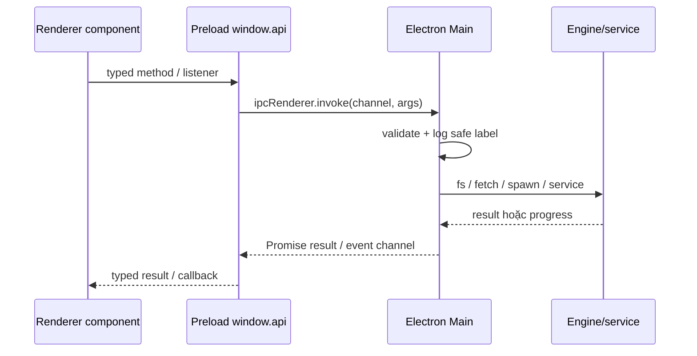

# IPC và feature registry

> Đọc tài liệu này khi task chạm vào `window.api`, `ipcMain`, progress/cancel hoặc thêm feature. Snapshot được đối chiếu ngày **2026-08-17**, version **0.1.25**.

## Boundary an toàn



Nguyên tắc:

- Renderer chỉ gọi `window.api`; không import `electron`, `fs`, `child_process` hoặc secret.
- Preload chỉ là adapter: `ipcRenderer.invoke`, `ipcRenderer.on` và cleanup listener.
- Main phải validate lại URL, path, enum, số lượng và quyền file dù Renderer đã kiểm tra.
- Kết quả IPC phải serializable; không trả `BrowserWindow`, `ChildProcess`, stream hoặc object Electron thô.
- Tác vụ dài giữ child process/AbortController trong Main adapter/service; cancel phải kill/cleanup ở Main.
- Không ghi cookie, API key, token hoặc URL có credential vào log/progress/UI.

## Contract và điểm nối

| Lớp | File | Trách nhiệm |
| --- | --- | --- |
| Shared core | `src/shared/types.ts` | request/result/progress cho core IPC |
| Shared feature | `src/shared/features/<id>.ts` | `FEATURE_ID`, metadata, channels và contract riêng |
| Main core | `src/main/index.ts` | `registerIpc()` đăng ký 68 handler core |
| Main feature | `src/main/features/registry.ts` + `*.ts` | namespace check và handler feature |
| Preload core | `src/preload/index.ts` | `coreApi` và event cleanup |
| Preload feature | `src/preload/features/registry.ts` + `*.ts` | merge feature API, chống collision |
| Renderer core | `src/renderer/src/App.tsx` + components | gọi API, giữ state/queue và hiển thị progress |
| Renderer feature | `src/renderer/src/features/registry.ts` + feature folder | tab metadata, component và keep-alive |
| Guard | `scripts/check-architecture.mjs` | kiểm tra cặp channel, API, feature registry và reserved IDs |

`src/preload/index.ts` expose đúng một object `window.api` bằng `contextBridge.exposeInMainWorld('api', api)`. `assertNoPreloadApiCollisions(coreApi, featureApi)` phải chạy trước khi expose.

## Core request channels

Source hiện có **68 request channels**; danh sách dưới đây được trích từ literal handler/invoke trong `src/main/index.ts` và `src/preload/index.ts`.

### Runtime, app, update, logs, dialog và shell

| Nhóm | Channels |
| --- | --- |
| Setup/runtime | `deps:check`, `deps:setup` |
| App | `app:downloadsDir`, `app:version` |
| Update | `update:check`, `update:status`, `update:install` |
| Logs | `logs:get`, `logs:clear`, `logs:openFile` |
| Dialog | `dialog:chooseFolder`, `dialog:chooseFiles`, `dialog:chooseSrt`, `dialog:chooseAudio` |
| Shell | `shell:showItem`, `shell:openPath`, `shell:openExternal` |
| Proxy/font | `proxy:test`, `fonts:list` |

Logger ghi bản runtime vào `app.getPath('userData')/logs/tblao.log` và tab **Hỗ trợ** có nút mở trực tiếp file này. Workflow Dịch SRT ghi trace cho từng phase, thao tác đọc SRT, request/repair Gemini, response JSON đầy đủ theo từng attempt, audit batch, target bản dịch, cleanup và heartbeat mỗi 30 giây. Khi một phase chạy từ 3 phút trở lên, log chuyển sang cảnh báo và ghi `elapsed`; payload chẩn đoán có thể chứa SRT/prompt nên chỉ chia sẻ file khi đã kiểm tra, còn API key và remote URI luôn được che.

### yt-dlp/download

| Channels | Main implementation |
| --- | --- |
| `ytdlp:info`, `ytdlp:playlist` | metadata/playlist probe trong `src/main/ytdlp.ts` |
| `ytdlp:download` | download media, archive, subtitle/metadata/thumbnail và post-process |
| `ytdlp:version`, `ytdlp:capabilities`, `ytdlp:update` | managed/PATH binary, capability probe và update |

### Cookie

| Channels | Ý nghĩa |
| --- | --- |
| `cookies:status`, `cookies:list`, `cookies:clear`, `cookies:capture` | cookie theo domain cho yt-dlp |
| `cookies:siteStatus`, `cookies:siteClear`, `cookies:siteCapture` | cookie site-specific Facebook/Bilibili, partition và login marker riêng |

`cookies.ts` không đưa giá trị cookie lên UI; status chỉ trả count/domain/expired/missing marker cần thiết.

### Douyin

`douyin:engineStatus`, `douyin:installEngine`, `douyin:download`, `douyin:cookieStatus`, `douyin:cookieClear`, `douyin:cookieCapture`, `douyin:channels`, `douyin:removeChannel`.

Main adapter dùng `engines/douyin-engine` binary từ `userData/bin`, config ở `userData/dy-config.yml`, database `userData/dy-library.db` và channel list `userData/dy-channels.json`.

### Whisper và CUDA

`whisper:engineStatus`, `whisper:installEngine`, `whisper:transcribe`, `whisper:detectGpu`, `whisper:cudaStatus`, `whisper:installCuda`.

`whisper:transcribe` trả `WhisperResult`; `whisper:progress` phát progress từ JSON-lines của engine. Device `cuda` chỉ được truyền khi user chọn và CUDA bundle tồn tại.

### OCR, burn và video enhancement

| Nhóm | Channels |
| --- | --- |
| OCR | `ocr:engineStatus`, `ocr:installEngine`, `ocr:video`, `ocr:cancel` |
| Subtitle/burn | `burn:start`, `burn:cancel`, `burn:srtGiay`, `burn:srt-preview`, `burn:voice-sync-scan` |
| Video2X | `video2x:engineStatus`, `video2x:installEngine`, `video2x:listDevices`, `video2x:start`, `video2x:cancel` |

`ocr:video` nhận tọa độ pixel của video gốc, spawn OCR engine và có thể đổi SRT sang nhiều format. `burn:start` xử lý soft/burn subtitle, blur/audio/style; `video2x:start` chạy binary và parse progress text.

### Translation

Provider chung:

- `translate:hasKey`, `translate:saveKey`, `translate:checkKey`, `translate:translateSrt`;
- `gemini:hasKey`, `gemini:saveKey`, `gemini:checkKey`, `gemini:translateSrt` là alias/legacy API cho Gemini.

Provider thực tế nằm trong `src/main/gemini.ts`, `src/main/openai.ts` và logic chia/validate SRT ở `src/main/translate-shared.ts`.

Feature `srt-translator` dùng Gemini structured generation cho workflow SRT-only và có đúng **9 IPC channels**:

| Channel | Hướng | Trách nhiệm |
| --- | --- | --- |
| `srt-translator:load` | Renderer → Main | đọc UTF-8, parse/validate SRT và trả count, cue cuối, fingerprint |
| `srt-translator:analyze` | Renderer → Main | đọc toàn bộ SRT, restore pass + audit pass theo ngữ cảnh văn bản và trả review tiếng Việt |
| `srt-translator:resolve` | Renderer → Main | nhận candidate tiếng Việt cho mọi cue unresolved và chốt canonical source |
| `srt-translator:translate` | Renderer → Main | bản địa hóa tuần tự theo locale, conversion/token facts, partial target result và cleanup terminal |
| `srt-translator:cancel` | Renderer → Main | hủy job hiện tại |
| `srt-translator:release` | Renderer → Main | giải phóng job khi đổi nguồn/đóng tab và cleanup idempotent |
| `srt-translator:progress` | Main → Renderer | event progress theo `jobId`, phase, percent, target và thông điệp an toàn |
| `srt-translator:export-one` | Renderer → Main | Save dialog và ghi một SRT đã hoàn tất |
| `srt-translator:export-all` | Renderer → Main | chọn thư mục và ghi các target đã hoàn tất; target lỗi được bỏ qua |

Contract và điểm nối:

- Shared: `src/shared/features/srt-translator.ts` định nghĩa DTO, locale preset, `FEATURE_CHANNELS`, verification mode, progress, partial result và export filename.
- Main adapter: `src/main/features/srt-translator.ts` chỉ xử lý IPC/dialog/file export; composition thật nằm ở `src/main/services/srt-translator-production.ts`.
- Job/service: `src/main/services/srt-translator-job.ts` giữ single active job, fingerprint gate, upload/reuse/delete, cancel/release và progress.
- Preload: `src/preload/features/srt-translator.ts` expose typed methods và cleanup listener; Renderer chỉ gọi `window.api`.
- Renderer: `src/renderer/src/features/srt-translator/` giữ state 5 bước, review, target locale, preview và export khi feature `keepAlive=true`.

`srt-translator:analyze` mặc định nhận duy nhất `sourcePath` của SRT. Job đọc toàn bộ SRT, phục hồi ASR bằng ngữ cảnh và audit độc lập; không yêu cầu chọn/upload/xem video hoặc audio. Kết quả text-only luôn mang hậu tố `_unverified.srt` để nhắc rằng không thể xác minh lời nói/hình ảnh gốc. `verificationMode: 'video'` và các channel media cũ chỉ còn tương thích với caller cũ, không được UI sử dụng.

Hai pass nguồn là restoration rồi audit độc lập. Restoration chỉ dùng toàn bộ SRT để kiểm tra ngữ pháp, ngữ cảnh, đồng âm/âm gần, tiếng lóng/phương ngữ, taxonomy, tên riêng, thuật ngữ, số và đơn vị; không được ghi nhận bằng chứng hình/âm thanh. Audit merge canonical facts và đưa cue mơ hồ thành candidate `meaningVi`/evidence tiếng Việt; `translate` bị khóa đến khi user resolve đủ. Locale target điều chỉnh văn phong, tiền tệ, đơn vị và tên loài theo vùng đích nhưng giữ identity/dữ kiện. Currency chỉ là lời thoại xấp xỉ, không phải giá trị thanh toán/giao dịch/kế toán; UI ghi công **Rates By ExchangeRate-API** ([ExchangeRate-API](https://www.exchangerate-api.com)) khi có rate snapshot.

Batch chạy tuần tự theo target; một target lỗi vẫn giữ các target thành công để preview/export. Progress/UI không trả payload; file log chẩn đoán có request/response để debug, nhưng không ghi API key hoặc remote URI.

### Kiểm thử SRT

`npm run test:unit` là đường chạy offline, dùng boundary giả và không gọi Gemini/rate API thật. `npm run test:smoke:srt` là live smoke **opt-in**, chỉ chạy với video/SRT mẫu đã duyệt và bốn biến môi trường tạm thời: `TBLAO_GEMINI_SMOKE_KEY`, `TBLAO_SRT_SMOKE_VIDEO`, `TBLAO_SRT_SMOKE_SRT`, `TBLAO_SRT_SMOKE_OUTPUT_DIR`. Sau smoke test phải xóa các biến; không commit key hoặc đường dẫn mẫu.

## Event channels

Source hiện có **20 event channels** và listener tương ứng trong Preload:

| Channel | Nguồn/sự kiện |
| --- | --- |
| `deps:setup-progress` | runtime setup |
| `ytdlp:progress` | yt-dlp download |
| `douyin:install-progress`, `douyin:progress`, `douyin:cookie-event` | Douyin setup/download/cookie |
| `whisper:install-progress`, `whisper:progress`, `whisper:cuda-progress` | Whisper engine/transcription/CUDA |
| `ocr:install-progress`, `ocr:progress` | OCR setup/run |
| `burn:progress` | FFmpeg subtitle/burn |
| `video2x:install-progress`, `video2x:progress` | Video2X setup/run |
| `translate:progress`, `gemini:progress` | translation provider progress |
| `cookies:capture-event`, `cookies:site-capture-event` | cookie capture status |
| `logs:entry`, `logs:cleared` | logger emitter → UI |
| `update:status` | `src/main/updater.ts` → packaged app update state |

Architecture checker đếm 20 core event channel dạng literal. `srt-translator:progress` là feature event channel được tạo từ shared `FEATURE_CHANNELS`, nên không nằm trong số đếm literal đó nhưng vẫn được ghép cặp qua feature preload/Main registry; tổng feature contract này có 9 channel như bảng trên.

Listener pattern chuẩn:

```ts
const listener = (_event: unknown, payload: Payload): void => callback(payload)
ipcRenderer.on(CHANNEL, listener)
return () => ipcRenderer.removeListener(CHANNEL, listener)
```

Không dùng anonymous callback nếu không thể remove đúng listener. Feature adapter dùng `subscribe` hoặc cùng pattern này.

## Feature registry hiện tại

Feature mới là vertical slice, không dùng namespace core. Registry phải có cùng feature ở shared/main/preload/renderer:

```text
src/shared/features/<id>.ts
src/main/features/<id>.ts
src/preload/features/<id>.ts
src/renderer/src/features/<id>/index.tsx
```

Ba registry:

| Registry | Nơi gọi | Guard |
| --- | --- | --- |
| `src/main/features/registry.ts` | cuối đăng ký core IPC trong Main | ID không reserved/trùng; channel phải bắt đầu bằng `<id>:` |
| `src/preload/features/registry.ts` | tạo `featureApi` | method không được ghi đè `coreApi`/feature khác |
| `src/renderer/src/features/registry.ts` | `App.tsx` map tab/pane | physical feature, metadata và component phải khớp |

`src/shared/features/contracts.ts` giữ `RESERVED_FEATURE_IDS`: app, core tabs, IPC namespaces và hạ tầng nội bộ như `deps`, `ytdlp`, `cookies`, `douyin`, `ocr`, `whisper`, `video2x`, `translate`, `update`… Feature mới phải dùng kebab-case namespace mới.

### Feature `media-inspector`

- Contract: `src/shared/features/media-inspector.ts`.
- Channels: `media-inspector:run`, `media-inspector:progress`.
- Main: `src/main/features/media-inspector.ts`.
- Preload: `src/preload/features/media-inspector.ts`.
- Renderer: `src/renderer/src/features/media-inspector/index.tsx`.
- Metadata: main placement, `keepAlive=false`; đây là scaffold được sinh bởi generator.

### Feature `scene-splitter`

- Contract: `src/shared/features/scene-splitter.ts`; PySceneDetect pinned `0.7.1`.
- Channels: `scene-splitter:engine-status`, `scene-splitter:install-engine`, `scene-splitter:run`, `scene-splitter:cancel`, `scene-splitter:install-progress`, `scene-splitter:progress`.
- Main: `src/main/features/scene-splitter.ts` → `src/main/services/sceneSplitter.ts`.
- Preload: `src/preload/features/scene-splitter.ts`.
- Renderer: `src/renderer/src/features/scene-splitter/index.tsx`.
- Metadata: main placement, `keepAlive=true`; queue/progress/selection không mất khi đổi tab.

### Feature `capcut-factory`

- Contract: `src/shared/features/capcut-factory.ts`.
- Channels: `capcut-factory:detect-environment`, `capcut-factory:pick-path`, `capcut-factory:inspect`, `capcut-factory:run`, `capcut-factory:repair`, `capcut-factory:cancel`, `capcut-factory:progress`.
- Main: `src/main/features/capcut-factory.ts` → `services/capCutFactory.ts`.
- Preload: `src/preload/features/capcut-factory.ts`.
- Renderer: `src/renderer/src/features/capcut-factory/index.tsx` + `styles.css`.
- Metadata: main placement, `keepAlive=true`; batch và kết quả project được giữ khi đổi tab.

### Feature `srt-translator`

- Contract: `src/shared/features/srt-translator.ts`; verification mode, source fingerprint, restoration/audit DTO, locale target, progress, partial result và export result.
- Channels: `srt-translator:load`, `srt-translator:analyze`, `srt-translator:resolve`, `srt-translator:translate`, `srt-translator:cancel`, `srt-translator:release`, `srt-translator:progress`, `srt-translator:export-one`, `srt-translator:export-all`.
- Main: `src/main/features/srt-translator.ts` → `src/main/services/srt-translator-production.ts` → `src/main/services/srt-translator-job.ts`.
- Main services: validation, Gemini Files transport, source restoration, source audit, locale profiles, exchange rates, measurement conversion và localization được tách theo single responsibility.
- Preload: `src/preload/features/srt-translator.ts`.
- Renderer: `src/renderer/src/features/srt-translator/index.tsx` + `styles.css` + `model.ts`.
- Metadata: main placement, `keepAlive=true`; raw source và các bản dịch giữ trong memory của tab.
- Export: một target dùng Save dialog; `Xuất tất cả` dùng folder dialog, tên có hậu tố locale và `_unverified` khi text-only, tự tăng nếu file đã tồn tại.

## Quy trình thêm feature

Lệnh chuẩn:

```powershell
npm.cmd run feature:create -- batch-rename "Đổi tên hàng loạt"
```

Generator trong `scripts/create-feature.mjs`:

1. validate kebab-case và reserved namespace;
2. kiểm tra collision preload API;
3. tạo shared/main/preload/renderer file;
4. chèn import/module vào marker `feature-scaffold` của ba registry;
5. chạy hai TypeScript typecheck và architecture check;
6. rollback file/registry nếu check fail.

Feature lớn nên giữ `index.tsx` làm entry, tách hook/component/service theo miền; không import ngược Main vào Renderer hoặc đưa process handle qua Preload.

## Guard và cách kiểm tra

`scripts/check-architecture.mjs` kiểm tra:

- handler/invoke có cùng tập channel;
- sender/listener có cùng tập event;
- chỉ expose một `window.api` và có collision guard;
- Main/Preload/Renderer feature registry cùng tập ID;
- physical feature file không mồ côi;
- feature ID không trùng reserved namespace;
- feature channel có đúng prefix;
- marker registry xuất hiện đúng một lần.

Chạy:

```powershell
npm.cmd run check:architecture
```

Snapshot core source-level có 68 request/20 event; feature `srt-translator` bổ sung 9 channel namespace riêng (8 request + 1 progress event). Lệnh check cần package `typescript` trong `node_modules`; nếu môi trường chưa cài dependencies, kết quả phải được ghi là “chưa chạy được” thay vì suy ra từ số đếm thủ công.
