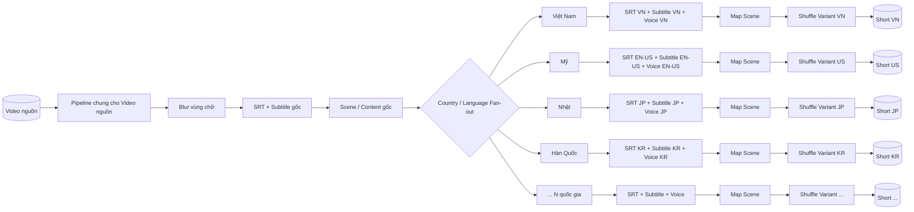
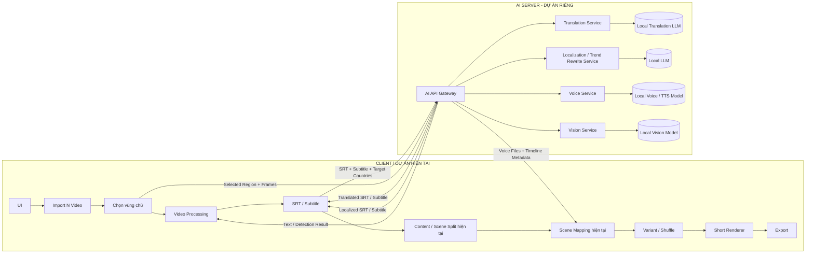
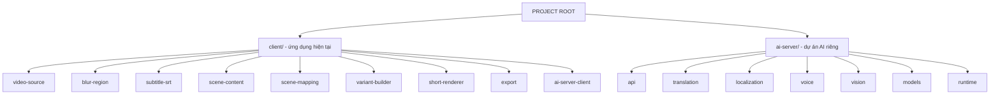

# Short Video Multi-Language Pipeline

## 1. Luồng xử lý tổng thể

```mermaid
flowchart TD

    START([Bắt đầu])

    START --> INPUT_VIDEO[Thêm N video nguồn]

    INPUT_VIDEO --> SELECT_BLUR[Chọn vùng cần kiểm tra và làm mờ chữ]

    SELECT_BLUR --> SOURCE_PROCESSING[Chuẩn hóa video nguồn]

    SOURCE_PROCESSING --> SUBTITLE_CREATE[Tạo phụ đề + SRT gốc]

    SUBTITLE_CREATE --> SELECT_COUNTRY[Chọn N quốc gia / ngôn ngữ đầu ra]

    SELECT_COUNTRY --> LANGUAGE_FANOUT{Tạo phiên bản theo từng quốc gia}

    LANGUAGE_FANOUT --> TRANSLATE[Chuyển phụ đề + SRT sang ngôn ngữ đích]

    TRANSLATE --> LOCALIZE[Điều chỉnh cách diễn đạt phù hợp quốc gia / trend<br/>không thay đổi nội dung]

    LOCALIZE --> VOICE[Tạo Voice theo phiên bản phụ đề + SRT]

    VOICE --> LANGUAGE_PACKAGE[Đóng gói Language Package]

    LANGUAGE_PACKAGE --> SCENE_SPLIT[Tách cảnh bằng hệ thống tách Content hiện tại]

    SCENE_SPLIT --> MAP_CONTENT[Map Scene + SRT + Voice<br/>theo từng quốc gia / ngôn ngữ]

    MAP_CONTENT --> CONTEXT_GROUP[Nhóm các Scene thuộc cùng / gần cùng ngữ cảnh]

    CONTEXT_GROUP --> VARIANT_SHUFFLE[Xáo trộn Scene / Content<br/>tạo Variant riêng cho từng quốc gia]

    VARIANT_SHUFFLE --> SHORT_BUILD[Build Video Short]

    SHORT_BUILD --> EXPORT[Export từng Video]

    EXPORT --> OUTPUT_VIDEO[(Output<br/>N Video nguồn × N Quốc gia)]

    OUTPUT_VIDEO --> END([Hoàn thành])
```



## 2. Fan-out theo quốc gia / ngôn ngữ



## 3. Kiến trúc Client + AI Server



## 4. Cấu trúc dự án đề xuất



## 5. Quan hệ Input → Output

```text
N VIDEO NGUỒN
      │
      ▼
[VIDEO 1] ─┬─> [VN] ─> [Variant VN] ─> short_vn.mp4
           ├─> [US] ─> [Variant US] ─> short_us.mp4
           ├─> [JP] ─> [Variant JP] ─> short_jp.mp4
           └─> [...] ─> [Variant ...] ─> short_x.mp4

[VIDEO 2] ─┬─> [VN] ─> [Variant VN] ─> short_vn.mp4
           ├─> [US] ─> [Variant US] ─> short_us.mp4
           ├─> [JP] ─> [Variant JP] ─> short_jp.mp4
           └─> [...] ─> [Variant ...] ─> short_x.mp4

...

[VIDEO N] ─┬─> [Language 1] ─> [Variant 1] ─> short_1.mp4
           ├─> [Language 2] ─> [Variant 2] ─> short_2.mp4
           └─> [Language N] ─> [Variant N] ─> short_n.mp4


OUTPUT = SỐ VIDEO NGUỒN × SỐ QUỐC GIA / NGÔN NGỮ ĐƯỢC CHỌN
```
